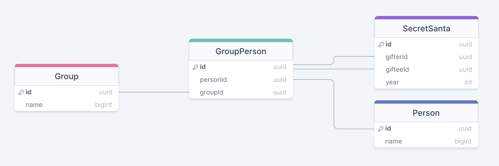

# Secret Santa

We want to create a server for an app that lets you randomize secret santa games. 
For it we designed the next database diagram:



## Endpoints

We defined an interface for the endpoints we will have in the server:

- `POST /api/group` to create a group
    - the body will be:
        ```
        {
            "name": <name_of_group>
        }
        ```   
- `POST /api/person` to create a person
    - the body will be:
        ```
        {
            "name": <name_of_group>
        }
        ```
- `POST /api/group/add/:person_id` to add a person to a group
- `POST /api/secret_santa/:group_id` to generate a random secret santa
    - the return body will be:
        ```
        {
            "user_a": "user_b",
            "user_b": "user_c",
            ...
        }
        ```
- `GET /api/secret_santa/:group_id` to get history of secret santas for previous years
    - the return body will be:
        ```
        {
            "2018": {
                "user_a": "user_b",
                "user_b": "user_c",
                ...
            },
            "2019": {
                ...
            },
            ...
        }
        ```

## Secret Santa Algorithm

### Version 1

Make a random secret santa for the group such that no one is their own Secret Santa

### Version 2

Make a random secret santa such that:
- No one is their own secret santa
- You can have the same secret santa once every three years

### Version 3

Add a new field named `tag` to the person entity that can be used to store a string tag for that person. If the secret santa is for a workplace it can be used to store the job area, or if it's for a family, it can be used to store the family surname. That way we can add some extra rules.

Make a random secret santa such that:
- No one is their own secret santa
- You can have the same secret santa once every three years
- Whenever possible try to match people that don't share the same tag value.